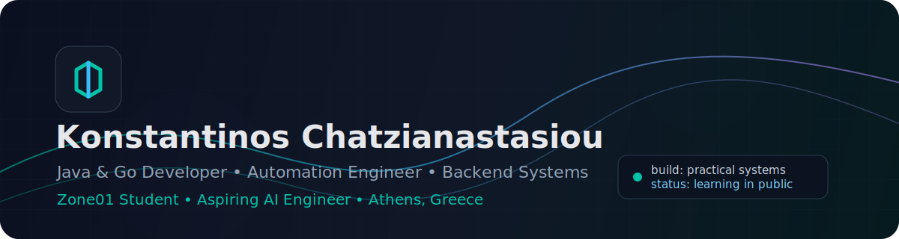
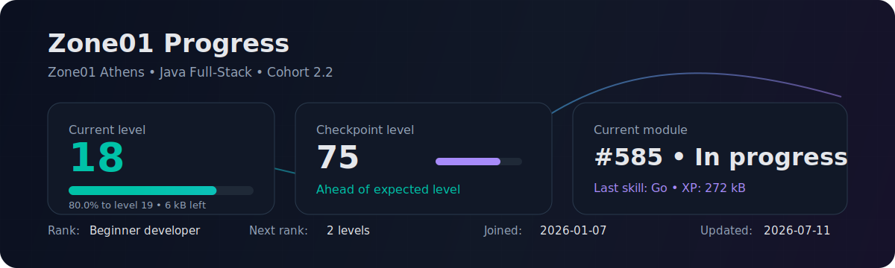
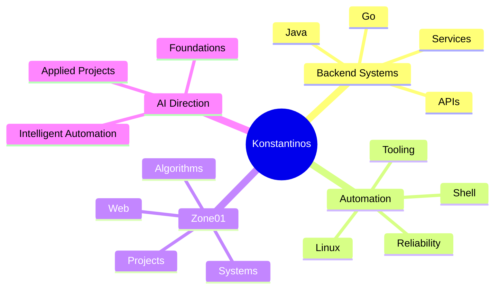

<div align="center">
  
</div>

<div align="center">
  <a href="https://github.com/kchatzian">
    
  </a>
</div>

<div align="center">
  
  
  
</div>

---

## Developer Profile

```go
type Developer struct {
    Name       string
    Location   string
    Focus      []string
    Stack      []string
    Learning   []string
    Direction  string
}

konstantinos := Developer{
    Name:     "Konstantinos Chatzianastasiou",
    Location: "Athens, Greece",
    Focus: []string{
        "Backend systems",
        "Automation tools",
        "Linux-based workflows",
        "Clean and practical software",
    },
    Stack: []string{"Java", "Go", "Linux", "Git", "Docker", "Shell"},
    Learning: []string{
        "System design",
        "Backend architecture",
        "AI engineering foundations",
    },
    Direction: "Building reliable software and growing toward AI engineering.",
}
```

## Current Signal

| Area | What I am building toward |
| --- | --- |
| Software Engineering | Java and Go applications with clean structure and practical architecture |
| Automation | Tools and workflows that reduce repetitive work and improve reliability |
| Backend Systems | Services, APIs, Linux environments, and server-side logic |
| Zone01 | Project-based learning across algorithms, systems, web, and backend concepts |
| AI Direction | Moving toward applied AI projects after strengthening backend foundations |

## Zone01 Progress

<div align="center">
  
</div>

This section is designed to evolve with my school progress. The current snapshot is generated from [`data/zone01.json`](./data/zone01.json), so it can be updated without rewriting the README.

## Tech Stack

### Languages


### Systems, Tools & Backend


### Learning Track


## Engineering Focus



## GitHub Analytics

<div align="center">
  
  
</div>

<div align="center">
  
</div>

<div align="center">
  
</div>

<!-- portfolio-projects:start -->
## Selected Projects

| Project | Focus | Why it matters |
| --- | --- | --- |
| [groupie-tracker](https://platform.zone01.gr/git/kchatzian/groupie-tracker-visualizations) | Go Web App | A Go web application that explores artist data with search, filters, geolocation, and visualizations. |
| [net-cat](https://platform.zone01.gr/git/kchatzian/net-cat) | Networking | A TCP chat/server project focused on client connections, concurrency, and terminal-based workflows. |
| [lem-in](https://platform.zone01.gr/git/hmim/lem-in) | Algorithms | A graph/pathfinding project that routes ants through rooms while optimizing movement over available paths. |
| [push-swap](https://platform.zone01.gr/git/kchatzian/push-swap) | Algorithms | A constrained sorting project focused on minimizing operations with two stacks. |

These are curated from Zone01 work and selected for portfolio signal, not project count.
<!-- portfolio-projects:end -->

## Portfolio Direction

| Type | Goal |
| --- | --- |
| Backend projects | Small but complete services that show API design, data flow, and clean code |
| Automation projects | Practical tools connected to real operational problems |
| Linux/server work | Scripts, deployment notes, and server-side engineering practice |
| Zone01 work | Public learning milestones where projects can be shared safely |
| AI projects | Applied AI features once the foundation is strong enough to show real work |

## Contact

<div align="center">
  <a href="https://github.com/kchatzian">
    
  </a>
  
</div>

---

<div align="center">
  <strong>Building reliable software, backend systems, and automation solutions while growing toward AI engineering.</strong>
</div>
